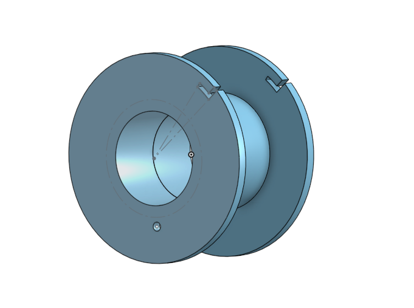

##### Contents: 

- [Tank](#tank)
- [Magnets](#magnets)
- [Controller](#controller)
- [Firmware](#firmware)
- [Animation and Software](#animation)
- [Budget](#budget)

Our system is comprised of mechanical, electrical, firmware, and software subsystems (click on diagram to enlarge image):

## Tank 

Our tank is comprised of two sheets of 10" by 12" glass with thickness 3/32" separated by a 1/4" acrylic rim. They are attached with epoxy.

Next, the tank was cleaned thoroughly using ammonia and hot water and scrubbed with ??.

## Magnets

The first plan for team FerroFish was to use PCB magnets. However, upon testing the PCB magnets we found that they were not viable for lifting and moving ferrofluid so the decision was made to create our own electromagnets.

Electromagnets are created by wrapping wire around a ferrous core and applying a voltage to the wire, creating a current in the wire. The current induces a magnetic field and thus magnetizes the ferrous core - creating a magnet.

The equation for the strength of the field given by our electromagnets is below:

$B = \frac{\mu_oNI}{l}$

Where $\mu_o$ is the permittivity of free space, $N$ is the number of turns in the wire, $I$ is the current, and $l$ is the length of the solenoid.

Electromagnets are more flexible than permanent magnets because they can be easily turned on and off by adjusting voltage. As a team we decided that electromagnets would provide the flexibility.

##### Creating our Electromagnets

We decided for cost purposes we would create our own electromagnets rather than buying premade ones. We calculated that 1000 turns would create a magnetic field strong enough to lift the ferrofluid.

Creating our electromagnets was three main steps:
1. 3D print spools for winding
2. Create the magnets by winding the wire
3. Soldering jumper cables onto the magnets so they can be used with controller boards

##### 3D Printing Spools

The spools were printeed in two parts and then glued together. These spools were then mounted onto the wiring rig so wire could be wound onto them. 

##### Winding the Wires

On the rig for winding the magnets there is a counter that let the winder know when 1000 turns had been reached. Our goal for the magnet grid was a 4x4 grid, or 16 total magnets. Extra spools were printed in the event we had magnets break.

##### Soldering the Magnets

Once the magnets were wound, jumper cables were soldered onto the ends of the wires. The connection between the wire and the jumper cable was then wrapped in a protective shrink wrap to prevent shorts with other wires. A finished magnet is pictured below.

##### Using the Magnets

We 3D printed a holder for our 4x4 magnet grid. This holder went through multiple iterations as we refined our tolerances and also created a way to hold the magnets to the tank. An image of all 16 magnets as well as the CAD for the final holder is below.

##### Final Take-Aways

While originally we did not think that creating our own electromagnets would be cost or time effective, by the end of our project, it was apparent that it was our best option. 

Creating the magnets required a lot of patience and communication, but ultimately, it created a better end product as we were able to successfully make a magnet grid with them and lift the ferrofluid.

## Controller and Electronics

Our magnet controller is based off of the [Applied Procrastination Electromagnet Control Board](https://hackaday.io/project/167056-fetch-a-ferrofluid-display/log/197057-fetch-v2-massive-hardware-upgrade) schematic. The main idea is to control an LED driver via I2C from your microcontroller to turn electromagnets on or off. The current out of the driver is not large enough to power the electromagnets, however, so we placed the signal through a Darlington transistor array. We included two sets header pins for our input signals and power rails, so we could chain together multiple boards, if we chose to expand the display.

Pullup resistors for I2C were selected based on [Adafruit schematics](https://learn.adafruit.com/assets/36269) for our LED driver. The capacitor values were chosen with help from Course Assistants Lauren and Corey as well as the Adafruit schematic.

The Arduino Mega was used due to an unfortunate frying of our Teensy 4.1 (may it rest in peace). The Arduino Mega has more memory than an Uno but has less memory and is slower than the Teensy.

The controller has 16 output pins, which connect to the 4 by 4 magnet array. It receives messages from the Arduino Uno, which can be programmed via Serial or with an SD card with animations preloaded.

## Firmware

## Animation and Software

## Budget

Our total cost for our final display was **$231.13**. Below shows the breakdown by subsystem and item:

| Tank           | Cost          |
|----------------|---------------|
| Glass panes    | $6.30         |
| Acrylic spacer | $4*           |
| Delrin holders | $2*           |
| Epoxy          | $10.94        |
| Ferrofluid     | $31           |
| Ammonia        | $1.78          |
| **Total**      | **$56.12** |

| Magnets and Structures      | Cost       |
|-----------------------------|------------|
| 3D-printed pieces (< 200 g) | $5*        |
| Threaded inserts            | $6.93      |
| M3 screws                   | $5.33      |
| Steel dowels                | $20.76     |
| Magnet wire                 | $10*       |
| **Total**                   | **$48.02** |

| Electronics (Mouser Part Number)            | Cost       |
|---------------------------------------------|------------|
| Dupont socket/socket connectors (485-266)   | $11.85     |
| Pin headers (649-1012937891601BLF)          | $3.99      |
| Darlington transistor arrays (511-ULQ2801A) | $16.25     |
| LED Drivers (771-PCA9685BS118)              | $24.96     |
| 0.1 uF Capacitors (963-HMF212B7104KGHT)     | $2.80      |
| 10 uF Polar Capacitors (710-865080340001)   | $2.52      |
| 10k resistors (652-CR0603FX-1002ELF)        | $0.75      |
| **Total** (including tax/shipping)          | **$75.06** |

| Boards                   | Cost       |
|--------------------------|------------|
| Arduino Mega*            | $34.93     |
| Custom controller boards | $15        |
| Perfboard                | $2*        |
| **Total**                | **$51.93** |

\* Estimate (Obtained for Free)

